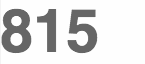

# ng-transiterate

AngularJS directive for eased iteration display



## Demo

A working demo can be foud on the project's site: [http://github.com/witq/ng-transiterate](http://github.com/witq/ng-transiterate)

## Install

The preferred installation method is just using Bower, like that:
```sh
$ bower install ng-transiterate
```
Remember to load the script file in your view:
```html
<script src="bower_components/ng-transiterate/dist/ng-transiterate.js"></script>
```
Then, reference the module (`ngTransiterate`) in your app:
```javascript
angular.module('myApp', ['ngTransiterate']);
```

## Use

The directive is very easy to use. The minimal working usage looks like that:
```html
<div transiterate="value"></div>
```
Where value is any numerical value bound to $scope. The directive sets the element's content to the supplied values and animates any changes.

### Optional attributes

#### duration
Sets the animation duration in miliseconds. Default is 800.
```html
<div transiterate="value" duration="6000"></div>
```
#### easing
Sets the easing method. This can be any of the Robert Penner's easing functions. Default it "easeInOutExpo".
```html
<div transiterate="value" easing="easeOutQuad"></div>
```
#### precision
Sets how precisely should floating numbers be displayed. Default is 0 (display as rounded integers). This parameter is used only when no filter is selected.
```html
<div transiterate="value" precision="2"></div>
```
#### filter
Sets which angular filter the directive should use for display. Default is none. If a filter requires parameters, they should be passed like that: `number:3`. This sets the filter to number with optional fractionSize parameter.
```html
<div transiterate="value" filter="number:3"></div>
```

## Contributing

This directive is my first jab at creating something universal and reusable. If you have any ideas how to make it better, PR's and suggestions are welcome.
